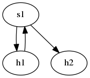

# fake-mininet
Fake mininet, use for experiments and education.

## Support Commands

[See more](cmd.md)

## Build

* `make` to build the executable file.
* `./mn` to enter fake-mn's CLI.
* Then you can use the supported commands to create your own fake network topology.

## TODO

* [x] Output dot file for current topology.
* [x] Add more information/operation on edge. (For graph theory)
* [ ] Create real virtual device that support real network functions.

## Example

You can see the [example](example/):

| Scenario | Description | Command | Result |
| :--- | :--- | :--- | :---: |
| **Network Flow** | Generate the simple graph, and export it's dotfile. And using graphviz to generate png from this dotfile. | [1] |  |

Command References:    
[1]
```sh
$ make && ./mn < example/simple_graph.txt
$ dot -Tpng example/simple_graph.dot -o example/simple_graph.png
```

## Author

Kevin Cyu, kevinbird61@gmail.com