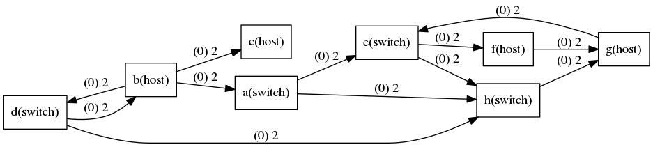
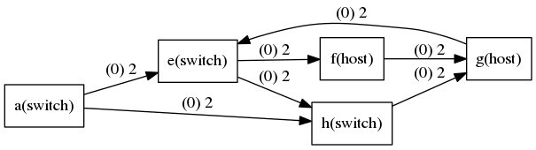

# fake-mininet
Fake mininet, use for experiments and education.

## Support Commands

[See more](cmd.md)

## Build

* `make` to build the executable file.
* `./mn` to enter fake-mn's CLI.
* Then you can use the supported commands to create your own fake network topology.

## Usage

* Enter CLI directly (manual): `./mn`
* Using script (mininet-like): `./mn -f <your script>`
* API usage: run `make lib` first, and see `Example` part for other details.

## Example

You can see the [example](example/):

| Scenario | Description | Command | Result |
| :--- | :--- | :--- | :---: |
| **CLI: Network Flow** | Generate the simple graph, and export it's dotfile. And using graphviz to generate png from this dotfile. | [1] |  |
| **API: Example (build & demo)** | Using `make lib` to generate library of fake-mininet - `libfakemn.a`, and use it within your program. | [2] | [api example code](example/api/api.cc) |
| **API: Path between 2 vertices** | Using API (`NetworkManager`, `Path`) to create network topology, and get the available paths between 2 selected vertices. | [2] | [path example code](example/api/path.cc) |
| **API: Find Max-Flow** | Apply *Ford-Fulkerson Labeling Algorithm* on simplest graph, which present in the [first demo](example/stdin/simple_graph.png). | [2] | [max-flow example code](example/api/max-flow.cc) |
| **API: Plot the Network Topology** | Using `Gplot` class to generate dotfile from your current network topology. (Export a dotfile, will need graphviz dependency to generate figure from this file.) | x |  |
| **API: DFS** | Apply depth-first search on the network present in the previous plotting example. ( Start point: `"a"` ) | x |  |

Command References:    
[1]
```sh
$ make && ./mn < example/stdin/simple_graph.txt
$ dot -Tpng example/stdin/simple_graph.dot -o example/stdin/simple_graph.png
```

[2]
```sh
$ make lib && cp libfakemn.a example/api
$ cd example/api && make
```

## TODO

* [x] Output dot file for current topology.
* [x] Add more information/operation on edge. (For graph theory)
* [ ] Create real virtual device that support real network functions.

## Author

Kevin Cyu, kevinbird61@gmail.com